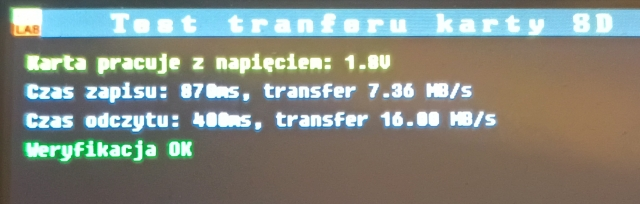

# APL3
### Projekt eksperymentalnego autopilota dla samolotów RC z obsługą kamery cyfrowej.

To są początki projektu. Obecnie jest zaimplementowana następująca funkcjonalność:
### Rdzeń CM7:
- Sterowanie wyświetlaczem LCD 480x320 po magistrali SPI.
- Odczyt i 3-punktowa kalibracja ekranu dotykowego. Do uruchomienia jest jeszcza kalibracja wielopunktowa.
- Menu graficzne do obsługi wielu funkcjonalności, ekran powitalny z prezentacją wykrytego sprzętu.
- Obsługa pamieci Flash NOR S29GL256S90 na magistrali równoległej 16-bit
- Obsługa pamięci Flash W25Q128JV na magistrali QSPI
- Obsługa zewnętrznej pamięci statycznej IS61WV204816BLL na magistrali równoległej 16-bit
- Obsługa zewnętrznej pamieci dynamicznej AS4C32M16SC-7TIN na magistrali równoległej 16-bit
- Testy pomiaru transferu dla wszystkich pamięci
- System zapisu konfiguracji do pamięci Flash w paczkach po 30 bajtów + 2 bajty ID i sumy kontrolnej
- Wymiana danych z rdzeniem CM4 i prezentacja ich na LCD
- Uruchomiony FreeRTOS
- Uruchomiona komunikacja po LPUART przez BDMA
- Wyświetlacz pracuje w osobnym wątku o niskim priorytecie nie blokując głównego wątku. Dostęp do SPI sterowany jest sprzętowym semaforem z proprytetem dla pozostałych układów na magistrali.
- Komunikaty głosowe (16bit, 16kHz) są już wgrywane do pamięci flash. Poprzedza je tablica[128] zawierająca adresy i rozmiary komunikatów
- Wymawia komunikaty głosowe zawierajace liczby z zakresu 0,1..999k 
- Interfejs karty SD ma poprawnie przełaczane przez bibliotekę napiecie dla IO między 3,3V a 1,8V, po to aby móc obsługiwać szybsze karty
- Dodano narzędzie do oczytania parametrów karty deklarowanych przez producenta

- Jest elementarny zapis / odczyt karty SD o transferze 7 / 16 MB/s dla karty high speed klasy C10 ( min. zapis 10MB/s)

- Prezentacja układów IMU na ekranie powitalnym
- Uruchomiony system FAT na karcie, uruchomiony loger danych pomiarowych
- Dodana obsługa zegara czasu rzeczywistego jednak jeszcze nie działa z powodu niewłaściwego kwarca.
- Rysowanie kostki 3D wizualizującej działanie IMU

- Rysowanie wykresów biegunowych przy kalibracji magnetometru i sterowanie całym procesem
- Rysowanie okna kalibracji skalowania czujników ciśnienia
- Rysowanie okna weryfikacji magnetometrów w obrocie płaskim
- Uruchomiono komunikację po CAN udostępniając na zewnątrz jeden z magnetometrów
- Uruchomiona telemetria, wysłanie danych w indywidualnej funkcji czasu dla każdej zmiennej, zapis i odczyt konfiguracji przez NSK 
- Wyświetlanie nastaw regulatorów PID
- Wyświetlanie stanu kanałów odbiornika RC

- Obsługa mikrofonu na magistrali I2S
- Przechwytywanie obrazu z kamery DCMI
- Uruchomiono nowy rodzaj znacznie tańszego wyświetlacza LCD opartego o chipset ILI9488
- Działają podstawy transmisji TCP/IP po ethernet

- Uruchomiono DMA2D z funkcją blendera
- Podstawowa wersja OSD działająca na żywo na obrazie kamery lub jako sama nakładka na szarym tle 
 
- Zapisuje pliki jpeg w monochromatycznym formacie Y8, oraz kolorowych YUV444, YUV420 i YUV420. 
- W pliku jpeg zapisuje strukturę Exif zawierajacą między innymi współrzędne GNSS 

### Rdzeń CM4:
- Obsługa pamięci FRAM
- Obsługa expandera IO
- Wymiana komunikatów z rdzeniem CM7
- Sterowanie pętla główną programu, podział czasu procesora na odcinki czasowe 20x250us
- Obsługa wyjść dla serw i ESC
- Odbiór danych z GNSS i parsowanie protokołu NMEA. Konfiguracja układów uBlox i MTK
- Odczyt danych z magnetometru HMC5883 na module GNSS
- Odczyt danych z magnetometrów MMC34160 i IIS2MDC na wewnętrznym module IiP
- Odczyt danych z żyroskopów i akcelerometrów w ICM42688
- Odczyt danych z żyroskopów i akcelerometrów w LSM6DSV

- Dodane automatyczne wyliczanie ciśnienia zerowego z czujników ciśnienia bezwzględnego i liczenie wysokości barometrycznej uwzględniającej wpływ temperatury
- Zapis konfiguracji do FRAM przeniesiony z APL2 i zaimplementowany w APL3
- Uruchomione czujniki ciśnienia różnicowego ND130 i MS4525. Już pokazują takie samo ciśnienie
- Kalibracja tempraturowa żyroskopów
- Kalibracja przesunięcia zera w funkcji temperatury i skalowania prędkości kątowej żyroskopów
- Kalibracja przesunięcia zera magnetometrów, normalizacja długości wektora magnetycznego i kompensacja pochylenia i przechylenia
 
- Skalowanie czujników ciśnienia na podstawie wzorca 27m (10 pięter)
- Obsługa regulatorów PID
- Obsługa miksera silników wielowirnikowca
- Obsługa odbiornika RC w standardzie PPM oraz S-Bus
- Obsługa 6 wyjść RC z protokołem Digital Shot: DShot150, DShot300, DShot600 i DShot1200 (oprócz standardowego PWM 400Hz i S-Bus). Na razie jednokierunkowe, bez telemetrii.
- Obsługa wyjść serw PWM: 50, 100 i 200Hz oprócz standardowego 400Hz.

 
 
 

  
    		
  		
