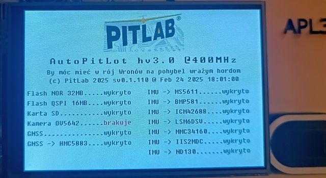

# APL3
### Projekt eksperymentalnego autopilota dla samolotów RC z obsługą kamery cyfrowej.

To są początki projektu. Obecnie jest zaimplementowana następująca funkcjonalność:
### Rdzeń CM7:
- Sterowanie wyświetlaczem od Raspbery Pi 480x320 po SPI.
- Odczyt i 3-punktowa kalibracja ekranu dotykowego. Do uruchomienia jest jeszcza kalibracja wielopunktowa.
- Menu graficzne do obsługi wielu funkcjonalności, ekran powitalny z prezentacją wykrytego sprzętu.
- Obsługa pamieci Flash NOR S29GL256S90 na magistrali równoległej 16-bit
- Obsługa pamięci Flash W25Q128JV na magistrali QSPI
- Obsługa zewnętrznej pamięci statycznej IS61WV204816BLL na magistrali równoległej 16-bit
- Obsługa zewnętrznej pamieci dynamicznej AS4C32M16SC-7TIN na magistrali równoległej 16-bit
- Testy pomiaru transferu dla wszystkich pamięci
- System zapisu konfiguracji do pamięci Flash w paczkach po 30 bajtów + 2 bajty ID i sumy kontrolnej
- Wymiana danych z rdzeniem CM4 i prezentacja ich na LCD
- Uruchomiony FreeRTOS
- Uruchomiona komunikacja po LPUART przez BDMA
- Wyświetlacz pracuje w osobnym wątku o niskim priorytecie nie blokując głównego wątku. Dostęp do SPI sterowany jest sprzętowym semaforem.
- Zaobserwowałem dziwne zachowanie i padło podejrzenie o przepełnianie się stosu jednego z wątków, więc została zrobiona  analiza i porządki ze stosami. Obecnie wygląda to tak:

- Komunikaty głosowe (16bit, 16kHz) są już wgrywane do pamięci flash. Poprzedza je tablica[128] zawierająca adresy i rozmiary komunikatów
- Wymawia komunikaty głosowe zawierajace liczby z zakresu 0,1..999k 
- Interfejs karty SD ma poprawnie przełaczane przez bibliotekę napiecie dla IO między 3,3V a 1,8V, po to aby móc obsługiwać szybsze karty
- Jest elementarny zapis / odczyt karty SD o transferze 7 / 16 MB/s dla karty high speed klasy C10 ( min. zapis 10MB/s)

- Prezentacja układów IMU na ekranie powitalnym
- Uruchomiony system FAT na karcie, uruchomiony loger danych pomiarowych
- Dodana obsługa zegara czasu rzeczywistego jednak jeszcze nie działa z powodu niewłaściwego kwarca.

### Rdzeń CM4:
- Obsługa pamięci FRAM
- Obsługa expandera IO
- Wymiana komunikatów z rdzeniem CM7
- Sterowanie pętla główną programu, podział czasu procesora na odcinki czasowe 20x250us
- Obsługa wyjść dla serw i ESC
- Odbiór danych z GNSS i parsowanie protokołu NMEA. Konfiguracja układów uBlox i MTK
- Odczyt danych z magnetometru HMC5883 na module GNSS
- Odczyt danych z magnetometrów MMC34160 i IIS2MDC na wewnętrznym module IiP
- Odczyt danych z żyroskopów i akcelerometrów w ICM42688
- Odczyt danych z żyroskopów i akcelerometrów w LSM6DSV

- Dodane automatyczne wyliczanie ciśnienia zerowego z czujników ciśnienia bezwzględnego i liczenie wysokości barometrycznej uwzględniającej wpływ temperatury
- Uruchomione czujniki ciśnienia różnicowego ND130 i MS4525. Już pokazują takie samo ciśnienie

#### Do zrobienia:
 - Uruchomić zewnętrzne rezonatory kwarcowe, wymienić kwarce na inne z mniejszym ESR
 - Podłączyć i uruchomić kamerę
 - uruchomić komunikację po ethernet
 - Przenieść z APL2 obsługę pętli głównej, serw, mikserów, zapisu konfiguracji do FRAM, telemetrii do rdzenia CM4
  - Uruchomić układ ethernet
 - Uruchomić USB w trybie CDC
 - Zmodyfikować test transferu karty SD, tak aby działał z systemową obsługą FAT (obecnie działa poza FAT-em i systemem operacyjnym)
 
 
 

  
    		
  		
